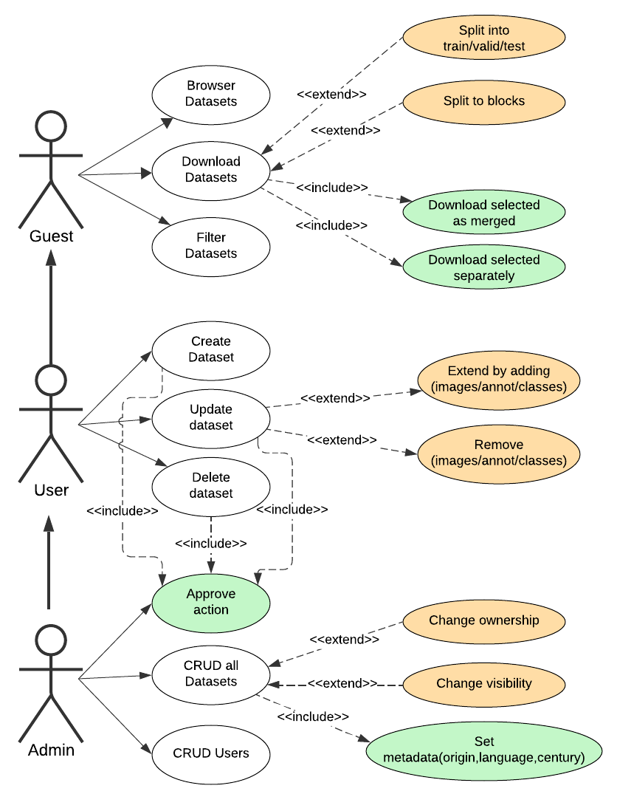
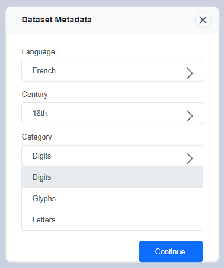
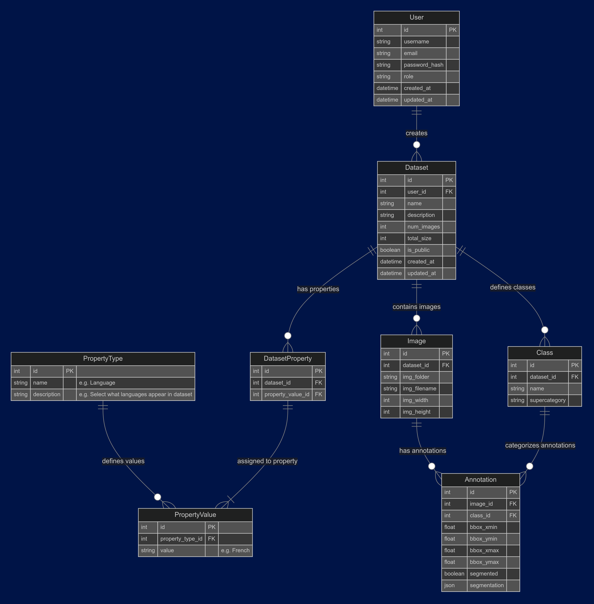
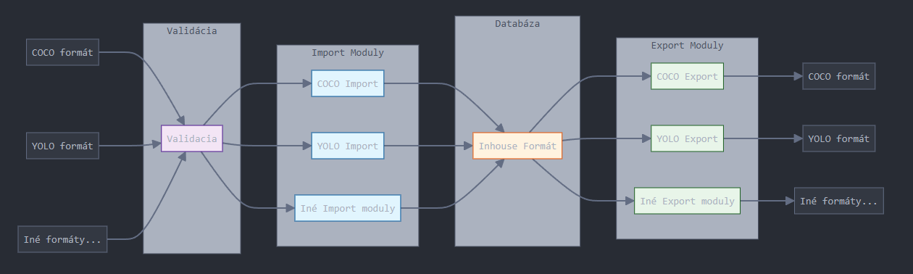
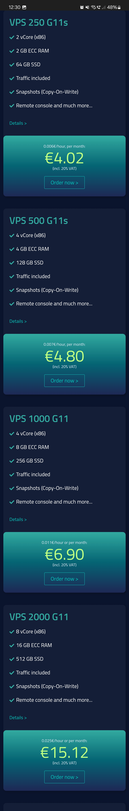

poo## Pripomienky z minulého semináru
1. **Výrazne obmedziť funkcionalitu pre užívateľov**:
   - Umožniť len nahratie datasetu a jeho úpravu.
   - Odstrániť funkcie ako klonovanie, spájanie, atď.
3. **Admin by mal potvrdiť každú zmenu od užívateľa** (Forma pull requestu).
4. **Hlavná funkcionalita pre návštevníkov**:  
   - On-the-fly vytváranie nových datasetov na základe filtrov.
5. **Metadáta pre dataset**:  
   - Pri nahrávaní datasetu sa pridávajú metadáta (rok, jazyk) pre filtrovanie.
7. **Unifikácia anotácií**:  
   - Konvertovať anotácie do jednotného formátu.
10. **Analýza našich VEGA datasetov**
9. **Prístup k datasetom**:
   - Chceme uchovávať aj súkromné datasety?

---

## Upravený use case


### Ukážka pridelenia metadát


## Upravený ER diagram


## Workflow nahratia a stiahnutia datasetu

## Analyza VEGA datasetov
Aktualne anotovane datasetu su:  
- Cislice
- Glyfy

Oba datasety su v:
- ORIGINAL SIZE: COCO format
- CROPPED(640x640): YOLOv8 format
Datasety s blokmi majú mnohé augmentácie.
### 1.1 Číslice
#### Original size:
Format: COCO
Pocet obrazkov: 42  
Kategorie:   
  ```yaml
  _background_, 0, 1, 2, 3, 4, 5, 6, 7, 8, 9
  ```  
Kategória `_background_` nebola využitá ani raz naprieč celým datasetom.  
COCO formát umožňuje aj tzv. superkategóriu, ktorá ale nebola definovaná (nie je povinná).

#### Bloky:
Formát: YOLOv8  
Počet obrázkov: 3100 bez augmentácie  
S augmentáciou sú tam mierne odchýlky pri počte obrázkov  
Obsahuje originálne bloky a mnoho augmentácií  
Kategórie:

```yaml
names: ['0', '1', '2', '3', '4', '5', '6', '7', '8', '9']
```
Tieto datasety neobsahujú kategóriu `_background_`
### 1.2 Glyfy
#### Original size:
Formát: COCO  
Počet obrázkov: 511  
Kategórie: Názvy kategórií sú Unicode kódy, ktoré reprezentujú špecifické znaky (glyfy) čo najpresnejšie zodpovedajúce ich vizuálnej podobe. Tieto kódy sú doplnené o ďalšie symboly, ktoré presnejšie odzrkadľujú vzhľad a charakteristiku jednotlivých glyfov.  
*(Názvy kategórií ukážeme v Blokoch, keďže v YOLO formáte sú identické a zaberajú menej miesta)*
#### Bloky
Formát: YOLOv8  
Počet obrázkov: 10845 bez augmentácie  
S augmentáciou sú tam mierne odchýlky pri počte obrázkov  
Obsahuje originálne bloky a mnoho augmentácií    
Kategórie:

```yaml
nc: 162
names: ['N', 'Q', 'R', 'W', 'Z - -', 'Z - I', 'Z', 'u0023', 'u002a', 'u003d', 'u0043', 'u0054', 'u006d', 'u00d8', 'u0186', 'u01c2 - -', 'u01c2', 'u01c3', 'u0223', 'u0236 - - -', 'u0236 - -', 'u0236', 'u0255', 'u0266', 'u0271 - I', 'u0271', 'u0273', 'u0293', 'u0294', 'u0295', 'u0391', 'u039b', 'u03a5', 'u03a9', 'u03b1', 'u03b2', 'u03b8', 'u03ba', 'u03bb', 'u03c0 D _', 'u03c0', 'u03c6', 'u03c7 - -', 'u03c7', 'u03c9', 'u03f4', 'u03fe', 'u03ff', 'u04ba', 'u0564', 'u06ba - -', 'u06ba', 'u07c2', 'u0ba3', 'u0ce7 - -', 'u0ce7', 'u0e87 - - - -', 'u0e87 - - -', 'u0e87 - -', 'u0e87', 'u0ebd - -', 'u0ebd', 'u10c5', 'u10dd', 'u13ce', 'u1433', 'u146b', 'u1472 U -', 'u1472', 'u1542', 'u1543', 'u1546', 'u166d', 'u1687', 'u1691', 'u1692', 'u1722', 'u1723', 'u1d13', 'u1d133', 'u1d15f R -', 'u1d48', 'u1d78f', 'u1dc9', 'u1f74b', 'u1f75e', 'u1f761', 'u1f76a', 'u2020', 'u2026', 'u20df D I', 'u20df U I', 'u20df', 'u2113', 'u2118', 'u2125', 'u2164', 'u2200', 'u221e - -', 'u221e', 'u2290', 'u2293', 'u2295', 'u22a1', 'u22a5', 'u22b8 L I', 'u231c', 'u231d', 'u2571 R - - -', 'u2571 R - -', 'u2571 R -', 'u25a1', 'u25b3 - _', 'u25b3', 'u25eb', 'u25ec', 'u25ef', 'u2609 D I I I', 'u2609 L - R -', 'u2609 U I I I', 'u2609 U I _ I', 'u2609', 'u260a', 'u263E', 'u263f', 'u2640', 'u2641', 'u2642', 'u2644', 'u2648', 'u264b', 'u264d', 'u2650', 'u2651', 'u2652', 'u26bb', 'u26db', 'u2723', 'u2733', 'u27c6', 'u27d2', 'u27dc R I', 'u27dc', 'u2909', 'u29b5', 'u29b6', 'u29df - I', 'u29df', 'u2a4b', 'u2a68', 'u2ad8', 'u2aef - I', 'u2aef', 'u2af0', 'u2b35', 'u2caf', 'u2cc0 - -', 'u2cc0', 'u3059', 'ua609', 'ua72b', 'ufeea']
```
## VPS Netcup

