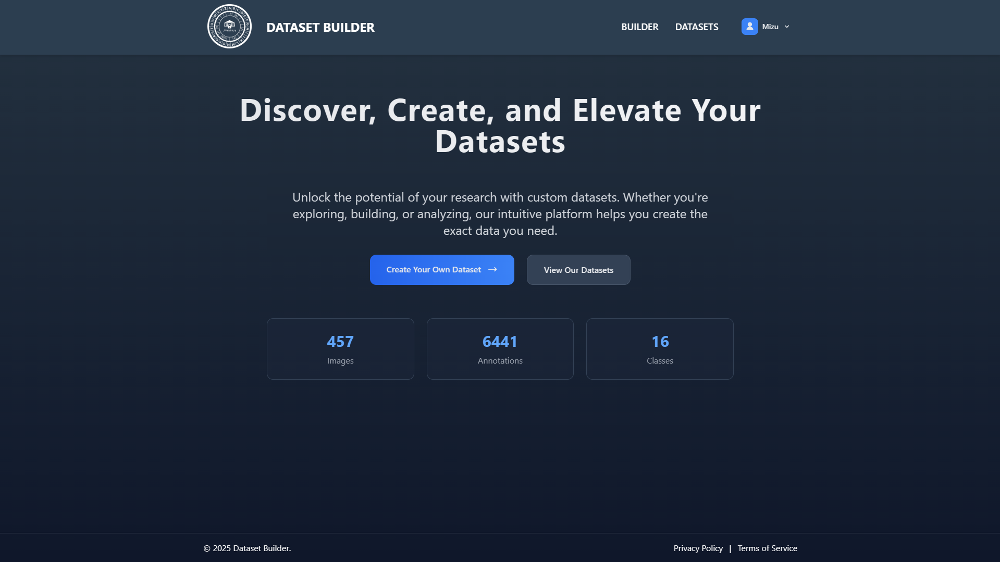

# Admin section

## Dashboard

## Admin Users

## Admin Invite

## Invitation

## Pending

## Expired

## Admin Datasets

## Settings

## Dataset Show

## Class Sample

## Builder

## Stage 1

## Stage 2
Ako riesit tieto filtre. Musi dataset obsahovat a zaroven neobsahovat vsetky vybrane metadata? 

## Stage 3

## Welcome

